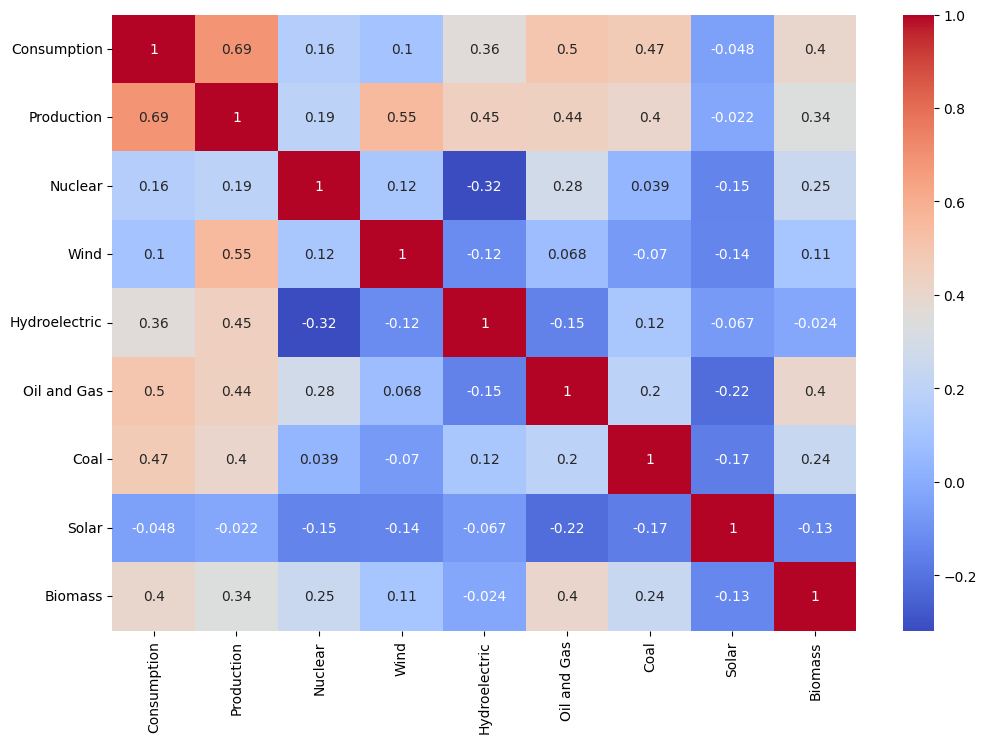
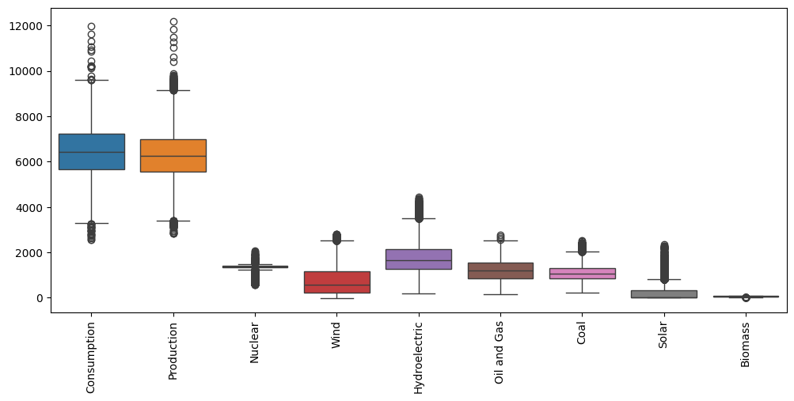
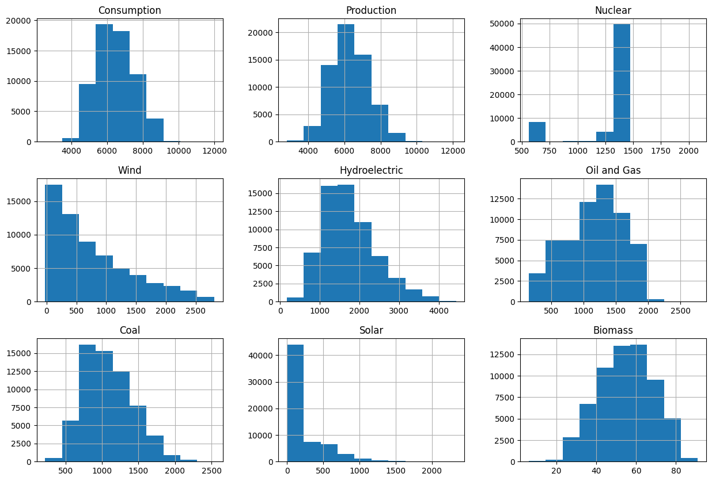

# Smart Hydro Forecast: AI-Based Hydroelectric Generation Prediction

## Project Overview

**Smart Hydro Forecast** is an Artificial Intelligence and Machine Learning project developed to predict hydroelectric power generation using historical hydroelectric and environmental data.

Hydroelectric power generation depends on several factors such as water availability, reservoir conditions, weather patterns, and historical generation records. This project applies Machine Learning techniques to analyze these factors and accurately forecast future hydroelectric power generation.

The primary objective is to support efficient renewable energy management and improve decision-making through data-driven predictions.

---

# Objectives

- Develop an AI-based hydroelectric power prediction system.
- Analyze historical hydroelectric generation data.
- Perform data preprocessing and exploratory data analysis.
- Build a Machine Learning prediction model.
- Improve model performance using hyperparameter tuning.
- Evaluate prediction accuracy using regression metrics.

---

# Key Features

- Data preprocessing and cleaning
- Exploratory Data Analysis (EDA)
- Statistical data visualization
- Correlation analysis using heatmaps
- Feature engineering
- Linear Regression model implementation
- Hyperparameter tuning using GridSearchCV
- Model evaluation
- Hydroelectric power generation prediction

---

# System Architecture

```text
Historical Hydro Data
        │
        ▼
Data Preprocessing
        │
        ▼
Exploratory Data Analysis
        │
        ▼
Feature Engineering
        │
        ▼
Linear Regression Model
        │
        ▼
GridSearchCV Hyperparameter Tuning
        │
        ▼
Model Evaluation
        │
        ▼
Hydroelectric Generation Prediction
```

---

# Machine Learning Methodology

## 1. Data Collection

The project uses historical hydroelectric generation data for training and testing the prediction model.

The dataset includes:

- Historical hydroelectric generation
- Water-related parameters
- Environmental factors
- Other influencing variables

---

## 2. Data Preprocessing

The dataset undergoes several preprocessing steps before model training.

These include:

- Handling missing values
- Removing duplicate records
- Data type conversion
- Feature selection
- Train-test splitting

---

## 3. Exploratory Data Analysis (EDA)

EDA is performed to better understand the dataset and identify relationships between variables.

Techniques include:

- Distribution analysis
- Correlation analysis
- Heatmap visualization
- Statistical summaries
- Outlier analysis

---

# Machine Learning Model

## Linear Regression

Linear Regression is used as the primary prediction model.

The model learns the relationship between the input features and hydroelectric power generation to make future predictions.

### Advantages

- Simple implementation
- Easy interpretation
- Efficient for regression problems
- Good baseline performance

---

# Hyperparameter Optimization

## GridSearchCV

GridSearchCV is used to optimize the model parameters by searching multiple parameter combinations.

### Benefits

- Improves prediction accuracy
- Finds optimal model configuration
- Reduces prediction error
- Enhances model performance

---

# Model Evaluation

The prediction model is evaluated using the following metrics:

### Mean Absolute Error (MAE)

Measures the average prediction error.

### Mean Squared Error (MSE)

Measures the average squared prediction error.

### R² Score

Measures how well the model explains the variability of the target variable.

Higher R² indicates better prediction performance.

---

# Results and Visualizations

## Correlation Heatmap



---

## Box Plot



---

## Distribution Plot



---

## Hydroelectric Distribution


---

# Technologies Used

| Technology | Purpose |
|------------|---------|
| Python | Programming Language |
| Google Colab | Development Environment |
| Pandas | Data Processing |
| NumPy | Numerical Computation |
| Matplotlib | Data Visualization |
| Seaborn | Statistical Visualization |
| Scikit-learn | Machine Learning |
| GridSearchCV | Hyperparameter Tuning |

---

# Project Structure

```text
Smart-Hydro-Forecast/
│
├── Images/
│   ├── heatmap.png
│   ├── boxplot.png
│   ├── distribution.png
│   └── Hydroelectric Distribution.png
│
├── AIML_CT_PROJECT_07_07_26_MOULA.ipynb
│
├── data.csv
│
├── requirements.txt
│
└── README.md
```

---

# Installation and Usage

## Step 1: Clone the Repository

```bash
git clone https://github.com/moula15/Smart-Hydro-Forecast.git
```

## Step 2: Navigate to the Project Folder

```bash
cd Smart-Hydro-Forecast
```

## Step 3: Install the Required Libraries

```bash
pip install -r requirements.txt
```

## Step 4: Open the Notebook

Open the notebook using **Google Colab** or **Jupyter Notebook**.

```text
AIML_CT_PROJECT_07_07_26_MOULASREE.ipynb
```

## Step 5: Run the Notebook

Execute all notebook cells sequentially to:

- Load the dataset
- Preprocess the data
- Perform Exploratory Data Analysis (EDA)
- Train the Linear Regression model
- Optimize the model using GridSearchCV
- Evaluate model performance
- Predict hydroelectric power generation

---

# Future Enhancements

- Random Forest Regression
- XGBoost Regression
- Real-time weather data integration
- Streamlit web application
- Model deployment using Flask
- Live hydroelectric generation dashboard

---

# Author

**Moulasree**

Final Year Student – Information Technology

GitHub: https://github.com/moula15

---

# License

This project is developed for educational and research purposes.
